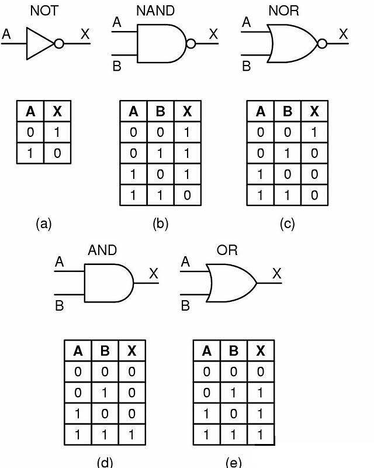

# Resumo livro lógica de programação
#### Lógica de programação e estrutura de dados com aplicações em Java

Autores: Sandra Puga e Gerson Rissetti 

* Algoritimos e lógica de programação 

```
Qual objetivo? 
    Desenvolver a lógica e o raciocínio do estudante,
    que, normalmente, sente dificuldade para
    elaborar e desenvolver algoritmos.
    
Não depende de linguagens mas sim do seu raciocínio e habilidade e
a linguagem é apenas uma ferramenta.
```

# Capítulo 1 - Introdução à lógica

* Criador da lógica.
* 
* Aristóteles ensinando Alexandre, o Grande 
* Gravura de Charles Laplante, Fonte: https://pt.wikipedia.org/wiki/Arist%C3%B3teles#L%C3%B3gica
```
O Filósofo Aristóteles é considerado o criador da lógica, 
mas ele não a chamava assim ele a denominava-a "Razão".

Originária do grego, 'logos' significa linguagem racional.
```

```
Lógica é a análise das formas e leis do pensamento,
mas não se preocupa com a produção do pensamento

Não se preocupa com conteúdo mas sim com a forma do pensamento. 
E o resultado sempre é true ou false

Ex:
    1. Sandra é mais velha do que Ricardo.
    2. Ricardo é mais velho do que Pedro.
    3. Logo, Sandra é mais velha do que Pedro.
```
Tipos de argumentos:

* Dedutivos ou Indutivos:
```
Indutivos: são baseados nos dados e chegamos em uma resposta por meio de 
analogia/comparação com algo conhecido.
Mas não temos certeza de que a resposta é verdadeira, se faz
necesário conhecer os fatos/situações para que seja possível comparar.

Ex:
    1. Ontem não havia nuvens no céu e não choveu.
    2. Hoje não há nuvens no céu.
    3. Portanto, hoje não vai chover.

Conclusão: a premissa1 e a premissa2 nos levam a uma conclusão induzida. 
```

```
Dedutivos: Onde a conclusão é obtida como consequência das premissas. 
Então só analisando a situação ou fato já obtemos a resposta.
É uma forma de sentença sem que haja necessidade de conhecimento prévio
das situações/fatos (conclusão obtida em decorrência de premissas.)

Ex:
    1. Joana é uma mulher.
    2. As mulheres são seres humanos.
    3. Logo, Joana é um ser humano.

De modo geral, podemos dizer que a dedução consiste no seguinte:
    1. A é verdade de B.
    2. B é verdade de C.
    3. Logo, A é verdade de C.
```
'A lógica nos permite caminhar pelos limiares das diversas ciências!'

### 1.1 O USO DO RACIOCÍNIO LÓGICO NO DIA-A-DIA
```
Desde os tempos primitivos o homem utiliza a lógica para realizar atividades.
Ex:
    * Foi utilizando-se do raciocínio lógico que o homem conseguiu criar a roda!
    * Uma pessoa adulta, para tomar banho, primeiro tira a roupa para não molhá-la e também
        para estabelecer contato direto entre sua pele e a água.
    *  Uma criança, desde pequenina, aprende que, para chupar uma bala, é preciso tirá-la da embalagem.
```
### 1.2 O USO DA LÓGICA APLICADA À INFORMÁTICA
```
A lógica é utilizada em diversas ciências, na informática, psicologia, física, direito entre outras
E na T.I aplicamos a todas as áreas tanto no hardware quanto software. 

Ex: 
    Na construção de circuitos para um teclado é utilizado conceitos de portas lógicas para
    a verificação da passagem ou não de pulsos elétricos;
    Já no software utilizamos o raciocínio lógico nos algoritmos. 
```
```
Algoritmo – Sequência de passos ordenados para a realização de uma tarefa.
Programa – Conjunto de instruções legíveis para o computador, capazes de realizar tarefas
```

Ex: Portas Lógicas


```
Podemos trabalhar com variáveis para construção de pensamentos e criar algoritimos na informática.

Ex: 
    1. Gerson é cientista.
    2. Todo cientista é estudioso.
    3. Logo, Gerson é estudioso.

    Substituindo as palavras “Gerson” e “estudioso” por A e B:
    1. A é cientista.
    2. Todo cientista é B.
    3. Logo, A é B.
```


# Capítulo 2 - Introdução aos algoritmos
````
````

# Capítulo 3 - Conceitos de programação
```
```

# Capítulo 4 - Conceitos básicos sobre algoritmos
```
```

# Capítulo 5 - Construção de algoritmos: estruturas de control
```
```

# Capítulo 6 - Estruturas de dados estáticas
```
```

# Capítulo 7 - Procedimentos e funções
```
```

# Capítulo 8 - Busca e ordenação
```
```

# Capítulo 9 - Acesso a arquivos
```
```

# Capítulo 10 - Estruturas de dados dinâmicas
```
```
